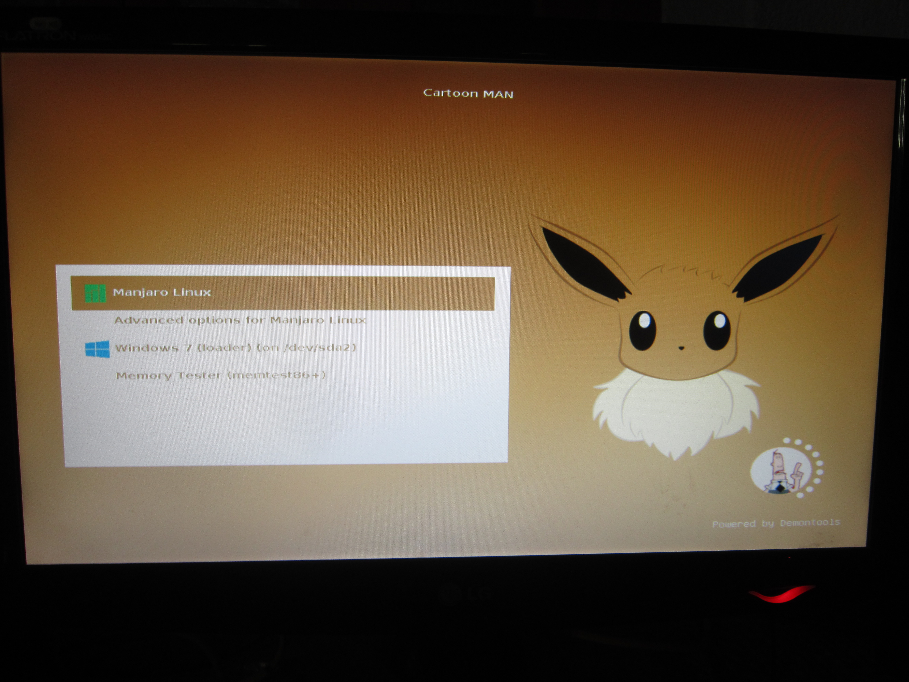

bloody_world
============

blood grub..

Config
-------
make a folder in your home directory called .grub (use alt + . or ctrl + h to unhide) and copy the theme folder in it:

  # mkdir ~/.grub
  # cp /path/to/theme ~/.grub

edit the file /etc/default/grub:

  # sudo gedit /etc/default/grub

write the following at the end of the file:

GRUB_THEME="/home/(username)/.grub/theme/theme.txt"

and now your last and final step is to update your grub:

  # sudo update-grub

reboot your pc and you will be provided with your new grub... enjoy :)

